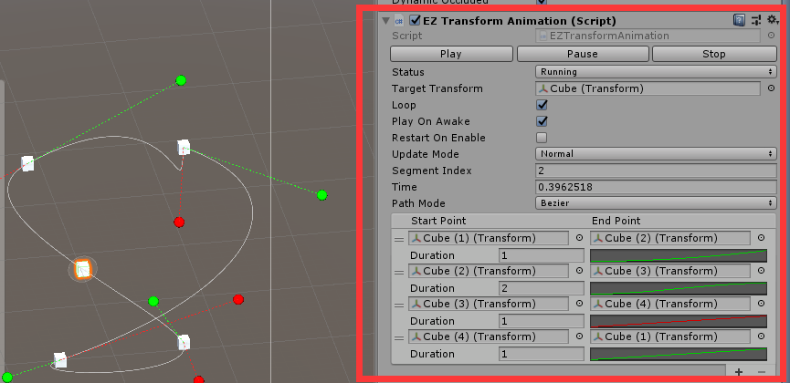

# EZAnimation，动画组件

Unity自带的Animator功能相当强大，所以在某些简单的动画制作上反倒显得过于复杂——特别是对于不需要状态机的动画。  
对于这些简单的动画控制，一般来说可以在代码中用协程或者DOTween实现，但这个方式不太友好，运行时调整起来比较闹心。  

EZAnimation使用AnimationCurve去做一些插值计算。

为了方便设计和编辑，这里用了一个Segment的概念对动画进行分段，一个Segment就是一段动画，包含自定义数据、持续时间Duration、曲线Curve。  
该组件的编辑器用到了ReorderableList，你可以很方便的在Inspector中进行重新排序或者插入删除操作。

例：

- EZTransformAnimation: 用来对Transform进行移动旋转缩放的动画，每个EZTransformAnimationSegment都包含两个路径点，在PathMode选项中可以选择使用折线或贝塞尔曲线

- EZRectTransformAnimation: 与EZTransformAnimation类似，不再赘述。

- EZGraphicColorAnimation: 用来对某个有Graphic（及其子类）组件的颜色进行Gradient动画，每个EZColorAnimationSegment都包含一个渐变颜色

