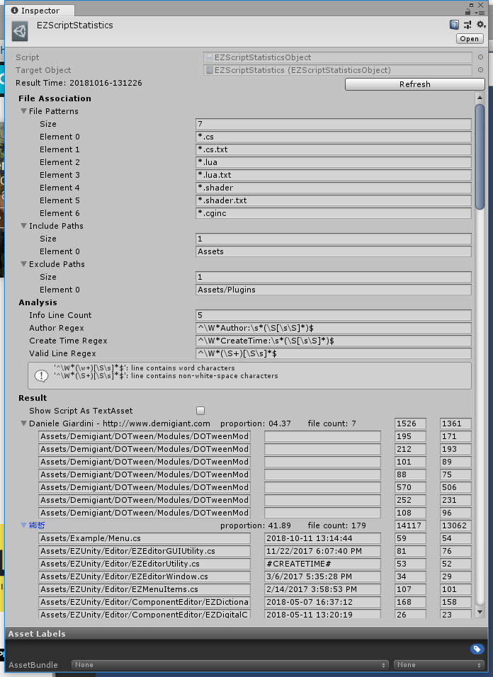

## EZScriptTemplate (Obsolete)

老的管理窗口废弃，新窗口位于ProjectSettings界面中，详见[EZProjectSettings](../../ProjectSettings)

## EZScriptStatistics

**用于统计当前的代码量**

需要事先说明的是，代码量并不能作为一个程序猿的考核标准，只应作为项目和个人的工作情况分析，不应在人与人、项目与项目间进行比较。

需要统计的范围在File Association中配置，"File Patterns", "Include Paths", "Exclude Paths"分别为要分析统计的文件后缀，要统计的目录，和需要排除在外的目录。

统计信息的收集方式在下方的Analysis中配置，"Info Line Count"为脚本头部信息的行数，"Author Regex"为匹配作者信息的正则式（需要一个匹配结果），"Create Time Regex"为匹配脚本创建时间的正则式（需要一个匹配结果），"Valid Line Regex"为匹配有效行的正则式（并不需要匹配结果）。

点击"Refresh"按钮进行统计，文件会自动备份。

统计结果以Author进行分组，对每个Author显示其名称，贡献度，脚本数量，有效行数，总行数。对每个脚本显示其路径，创建时间，有效行数，总行数。