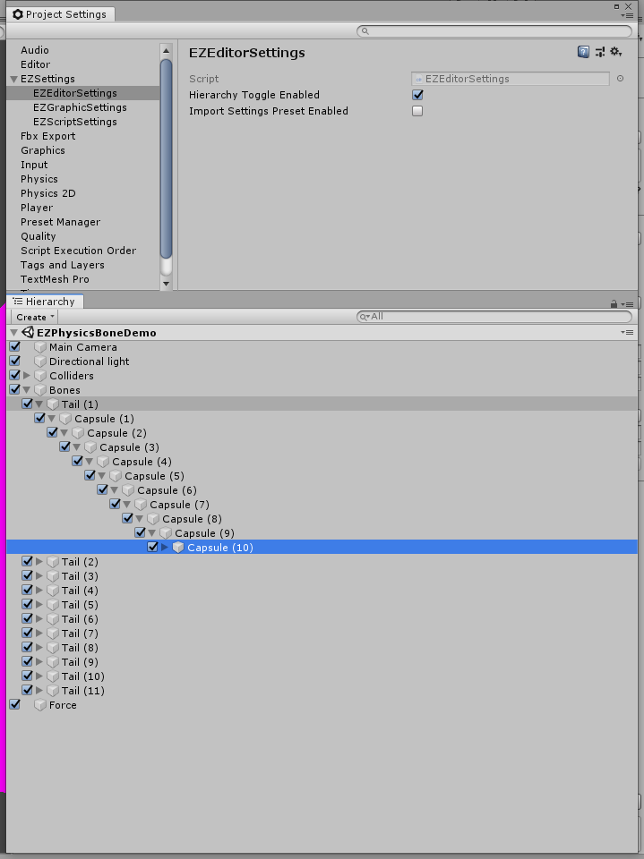
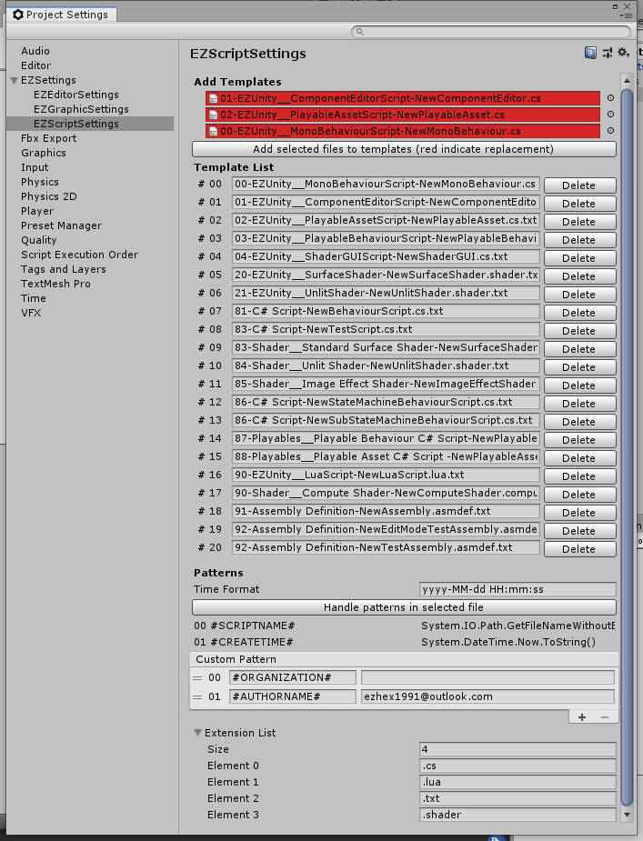

# EZProjectSettings

## EZEditorSettings

`Hierarchy Toggle Enabled`: 是否在Hierarchy窗口显示ActiveToggle

## EZGraphicSettings

## EZScriptSettings

**用于在编辑器下管理脚本模板，使用之前请为User添加Unity的Editor目录的write权限**。

Unity新建脚本的模板位于 [Unity安装目录/Editor/Resources/ScriptTemplates] 目录中，其中的".txt"文件如果命名符合一定的格式，那么Unity的Project右键菜单Create选项中会出现对应的选项（由于这个Create菜单是在Unity启动时初始化，所以添加模板后需要重启Unity才能生效，修改模板则会即时生效）。

从 [ProjectSettings/EZSettings/EZScriptSettings] 打开界面，并在Project中选中后缀符合规则的TextAsset后，界面上会出现选中的文件，点击添加按钮即可将文件拷贝到Unity模板目录中（可多选）。如果拷贝意味着替换，那么文件会显示在红底框中，如下图。

在新建脚本并重命名后，Unity会使用脚本文件名称来替换模板中的"#SCRIPTNAME#"，以该规则为基础，个人添加了一个"#CREATETIME#"变量，会在新建脚本时替换为当前的时间。另外，为了方便扩展，也可以自定义变量，添加在Custom Pattern中。这个功能使用`AssetModificationProcessor`实现，只对特定的后缀名有效（这里指的是文件后缀，模板后缀均为".txt"，对名以"脚本后缀+.txt"结尾的如".cs.txt"，该工具会将其判定为模板文件，不会替换这些变量）

