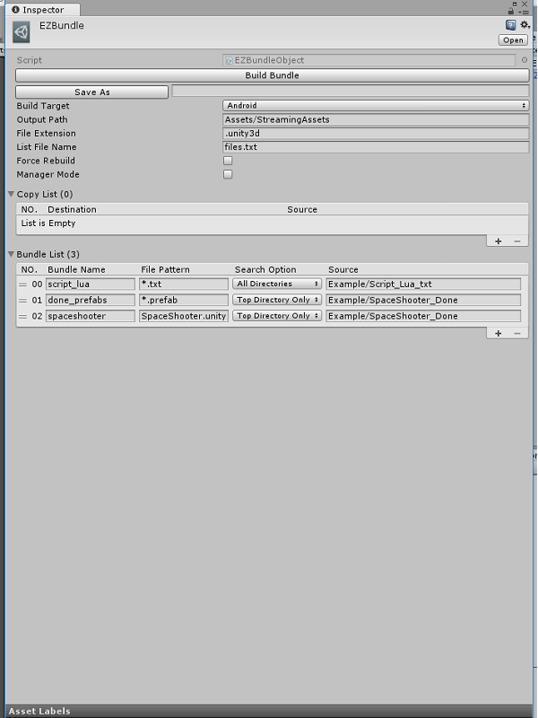
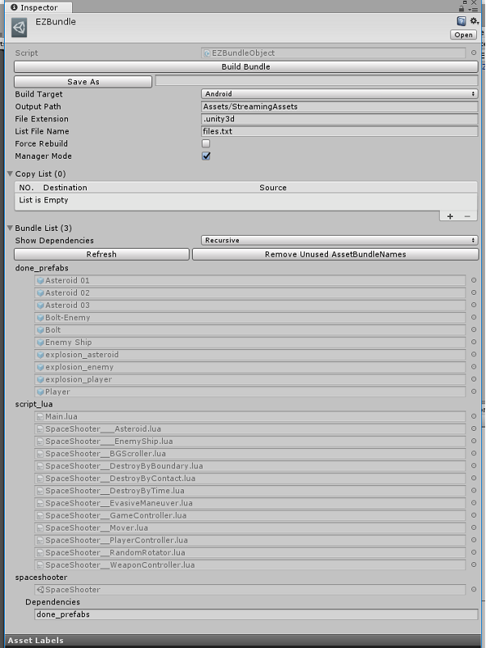

### EZBundle

Unity5.x中Bundle的build可以说是非常简单了，但是却没有一个官方的管理工具。
大部分项目使用bundle都是通过单个资源设置，然后代码中一句`BuildAssetBundles(string outputPath, BuildAssetBundleOptions assetBundleOptions, BuildTarget targetPlatform)`然后做成一个MenuItem，对于buildTarget、outputPath、后缀名等都是写死在代码中，通用性很差。

EZBundle会用一个*.asset文件保存Build偏好如：buildTarget, outputPath, fileExtension。选定该asset就可以编辑这些偏好，并且在Inspector界面中可以直接通过点击“Build Bundle”按钮进行build，并且还有SaveAs按钮可以将这个asset文件备份后进行修改，在测试时相当方便。(下面有图)

很多时候在build之后我们会需要将build的文件做一个list（方便热更新的文件检查，当然如果你不需要可以忽略），这个可以在Inspector界面中指定文件名，build完成后会自动生成一个包含文件名称，md5值，还有文件大小的文件清单。

有些时候需要在build前清除老的文件，ForceRebuild选项就是这个意思。

### Manager Mode 和 EZBundle Mode

大多数人熟知的bundle设置方式是对单个资源指定AssetBundleName，然后Build Bundle。通俗点说就是：**我要把这个asset，加入到这个Bundle里面，思维方式偏向于自底向上**。

而我个人在项目中对目录结构进行了规划，目录结构就决定了bundle的结构，期望的bundle管理方式是：**我要Build一个Bundle，它包含某个目录下的所有满足条件的asset，思维方式偏向于自顶向下**。好在Unity提供了另一个重载方法`BuildAssetBundles(string outputPath, AssetBundleBuild[] builds, BuildAssetBundleOptions assetBundleOptions, BuildTarget targetPlatform)`，这个方法不用在编辑器的Inspector界面中去挨个指定单个asset的AssetBundleName，而是可以自己通过代码去“收集”和“分类”想要build的asset。

**EZBundle可以在两种Build方式间随意切换**。

在选项中有一个Manager Mode，默认情况下是没有勾选的，这时你需要在一个列表中设置BundleName，然后指定这个Bundle以某个Pattern根据某种SearchOption在SourcePath中获取asset。这种方式对于已经有很多资源但是却一直没有bundle规划的项目来说相当友好，当然，如果你在这种情况下又没有一个好的资源目录结构，那我就无能为力了。不过，整理一下目录也不是个什么难事，比起下文介绍的方式，维护起来也要简单那么一点。

如果你勾选了Manager Mode，那么这个Bundle的设置界面会变成一个BundleManager界面，你可以看到目前你项目中所有AssetBundleNames，这个Name下面包含了哪些文件，以及它的Dependencies。这时界面中的“Build Bundle”按钮就会以这种方式进行build，EZBundle模式下的Bundle设置不会起任何作用（你也可以直接在UnityEditor的顶部菜单中点击"EZUnityEditor/EZBundle/EZBundleManager"打开单独的EZBundleManager窗口）。这个模式下虽然不能直接修改，但是你可以查看到所有设置过AssetBundle的asset，点击一下跳转到该资源，用起来也省掉大把可以用来快活的时光。

### OnPreBuildAttribute, OnPostBuildAttribute 和 CopyList

对于build Bundle，很多情况下意味着要出包，而出包，往往要做的前期工作不仅仅是build Bundle。

在使用EZBundle进行Build时，首先会通过反射寻找所有`OnPreBuild`标记过的方法并执行，然后执行CopyList中指定的拷贝，然后才是build bundle，最后会以`BuildPipeline.BuildAssetBundles`返回的`AssetBundleManifest`作为参数，调用`OnPostBuild`标记过的方法。

例如：该工程下的EZFramework使用了xlua，为了方便开发，所有的lua文件都以.lua为后缀，但是.lua文件是不会被build到bundle中的，所以在bundle前需要将这些文件拷贝并添加.txt后缀，为了方便读取还将路径中的slash改成了双下划线（PS: CopyList只能复制，做不到改名啥的），这个改名的工作也用方法进行了封装并做了一个菜单项，但每次在build前都需要点一下这个，也实在是有点浪费我右手的ATP和APM，于是我将该方法标记了`OnPreBuild`，这时候build前就会自动拷贝覆盖掉老的.lua.txt文件，节省了时间，还避免了遗忘导致build进去的是老代码的情况。  
而某个SDK，在安卓平台打包前需要将一些文件拷贝覆盖到StreamingAssets目录下，这时候只需要将原路径和目的路径添加在CopyList中，每次点击build bundle时这个事情就自动完成了。  
至于`OnPostBuild`，由于目前项目中没有使用，所以一直没测试过，据说有Bug。。。

### EZBundleViewer

顾名思义，用来查看某个Bundle里包含了那些文件。

当我们build bundle时，每个bundle都会生成一个对应的manifest文件，这个文件可以用记事本打开，其内容是Yaml格式，记录该bundle相关的信息。当你打开EZBundleViewer窗口并选择任意一个bundle后，如果在该bundle下找到其对应的manifest文件，那么Viewer将会读取该manifest并进行解析，获取其中的Assets和Dependencies信息，如果不存在对应的manifest文件，那么你可以勾选force load，Viewer将会默认选中的DefaultAsset为一个bundle文件并使用`AssetBundle.LoadFromFile`进行加载，并获取其中的Assets路径，这种情况经常会因为选取的文件不是bundle文件而报错，虽然目前并没有碰到什么诡异的状况，但仍然需要谨慎使用（其实好像并没有什么鸟用）。