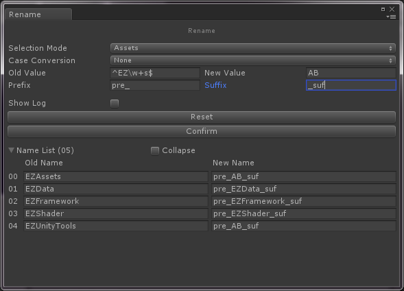

## EZRename

用来批量重命名的工具。选择资源就会加入到预览窗口，Collapse会折叠相同名称（多选是可以选择不同目录下相同名称）。在SelectionMode中选择过滤方式（Assets或者场景中的GameObject）。Case Conversion可以转换大小写。OldValue会替换成NewValue，OldValue支持正则式（如果正则式构造失败那就当普通字符串处理）。prefix和suffix用来添加前缀或后缀。Reset清除当前的填写的选项，Confirm确认。

