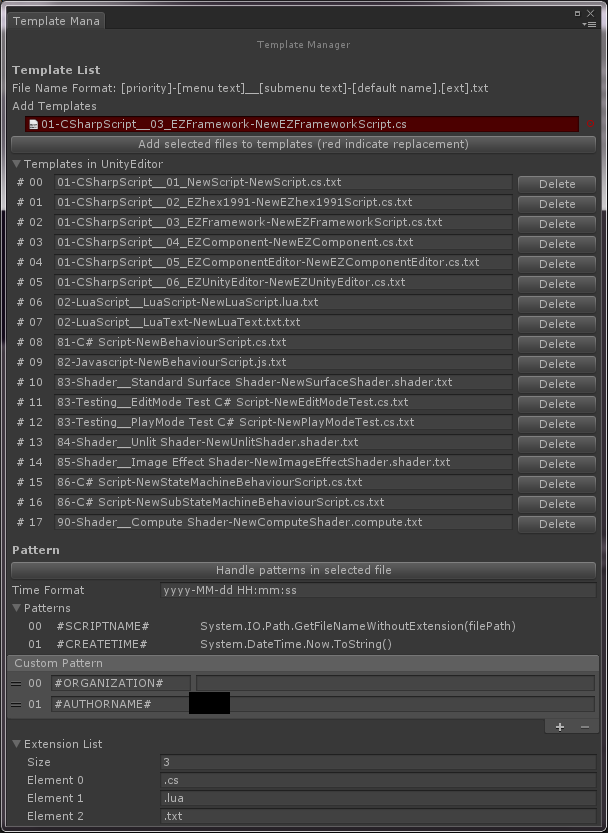
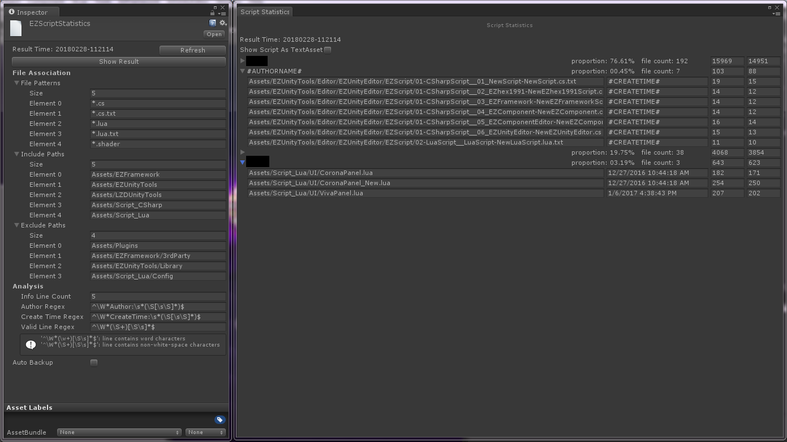

## EZScriptTemplate

**用于在编辑器下管理脚本模板**

Unity新建脚本的模板位于 [Unity安装目录/Editor/Resources/ScriptTemplates] 目录中，其中的".txt"文件如果命名符合一定的格式，那么Unity的Project右键菜单Create选项中会出现对应的选项（由于这个Create菜单是在Unity启动时初始化，所以添加模板后需要重启Unity才能生效，修改模板则会即时生效）。

从 [EZUnityTools/EZScript/Script Template] 中打开界面，并在Project中选中后缀符合规则的TextAsset后，界面上方会出现选中的文件和一个添加按钮，点击即可将文件拷贝到上面提到的模板目录中（可多选）。如果拷贝意味着替换，那么文件会显示在红底框中，如下图。

在新建脚本并重命名后，Unity会使用脚本文件名称来替换模板中的"#SCRIPTNAME#"，以该规则为基础，个人添加了一个"#CREATETIME#"变量，会在新建脚本时替换为当前的时间。另外，为了方便扩展，也可以自定义变量，添加在Custom Pattern中。这个功能使用`AssetModificationProcessor`实现，只对特定的后缀名有效（这里指的是文件后缀，模板后缀均为".txt"，对名以"脚本后缀+.txt"结尾的如".cs.txt"，该工具会将其判定为模板文件，不会替换这些变量）

## EZScriptStatistics

**用于统计当前的代码量**

需要事先说明的是，代码量并不能作为一个程序猿的考核标准，只应作为项目和个人的工作情况分析，不应在人与人、项目与项目间进行比较。

需要统计的范围在File Association中配置，"File Patterns", "Include Paths", "Exclude Paths"分别为要分析统计的文件后缀，要统计的目录，和需要排除在外的目录。

统计信息的收集方式在下方的Analysis中配置，"Info Line Count"为脚本头部信息的行数，"Author Regex"为匹配作者信息的正则式（需要一个匹配结果），"Create Time Regex"为匹配脚本创建时间的正则式（需要一个匹配结果），"Valid Line Regex"为匹配有效行的正则式（并不需要匹配结果）。

点击"Show Result"按钮就可以看到统计情况了，统计结果会直接保存在该配置对应的asset中，使用新的EditorWindow显示来获得更好的体验。下次点击"Show Result"会直接显示上次的结果，点击"Refresh"按钮则会重新进行统计。

统计结果以Author进行分组，对每个Author显示其名称，贡献度，脚本数量，有效行数，总行数。对每个脚本显示其路径，创建时间，有效行数，总行数。