# EZTextureProcessor

参数化图片处理工具

输出设置：（注：输出格式的修改不会影响导入格式）

- Output Resolution: 输出图片的分辨率
- Output Format: 输出图片的通道格式
- Output Encoding: 输出图片的编码格式
- Output Texture: 绑定的输出图片（输出时覆盖图片内容，不会更改导入选项，如果不指定则新建图片文件并绑定）
- Cooresponding Generator: 需要响应的其他图片生成器（执行当前文件后会自动执行响应文件，如果响应文件也有响应文件，则顺序执行）

## EZGaussianLutGenerator

高斯查找表

- Texture Type
  - Wave: 波浪图
  - Lut1D: U方向的1D查找表
  - Lut2D: 2D查找表
- Range: 取值范围
- Sigma: 标准差

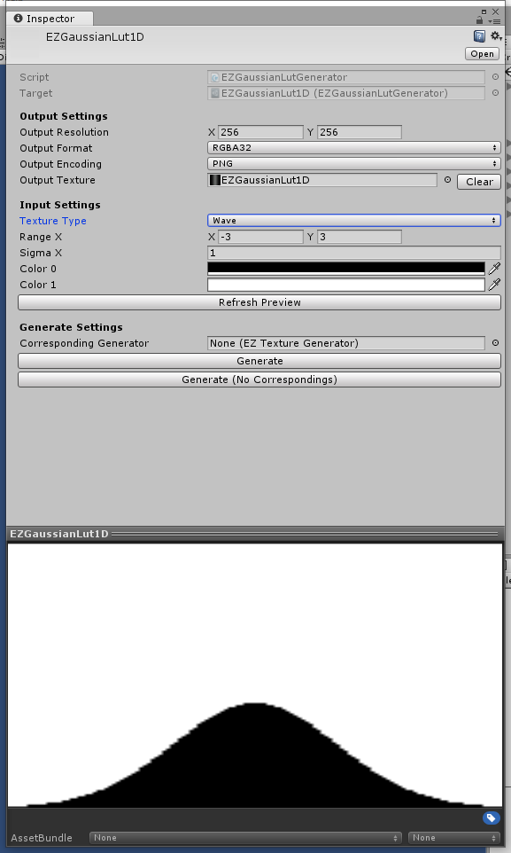

## EZGradient1DTextureGenerator

U方向，做Gradient的映射

- Gradient: 渐变
- Gradient Curve: 渐变曲线

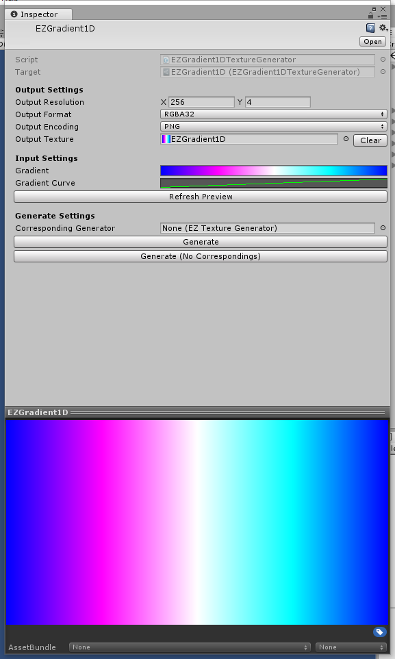

## EZGradient2DTextureGenerator

UV方向的取值到Gradient的映射，配合UV曲线可以生成很多复杂图案

- Gradient: 渐变
- Gradient Curve: 渐变曲线
- Coordinate Mode: 取值方式
  - X: U
  - Y: V
  - AdditiveXY: (U + V) / 2
  - MultiplyXY: U * V
  - DifferenceXY: Abs(U - V)
  - Radial: Sqrt((U - 0.5) ^ 2 + (V - 0.5) ^ 2)) * 2
  - Angle: Mathf.Atan2(V - 0.5, U - 0.5) / Mathf.PI * 0.5f;
- Coordinate Curve U: U坐标变化曲线
- Coordinate Curve V: V坐标变化曲线

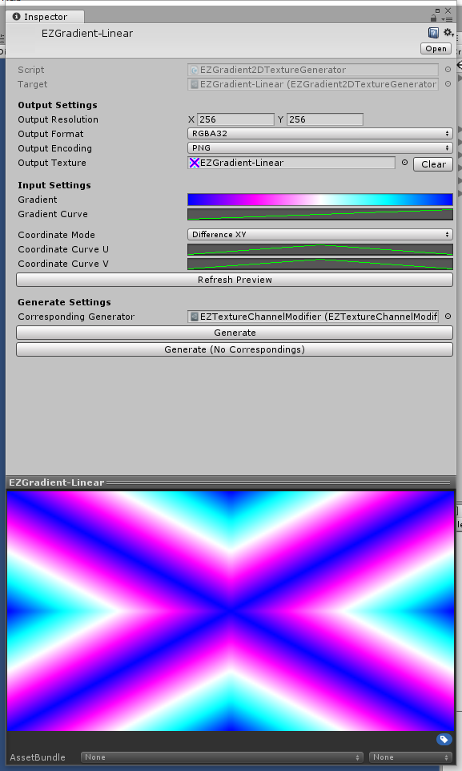

## EZPerlinNoiseTextureGenerator

柏林噪声图片生成

- Noise Density: 噪声密度

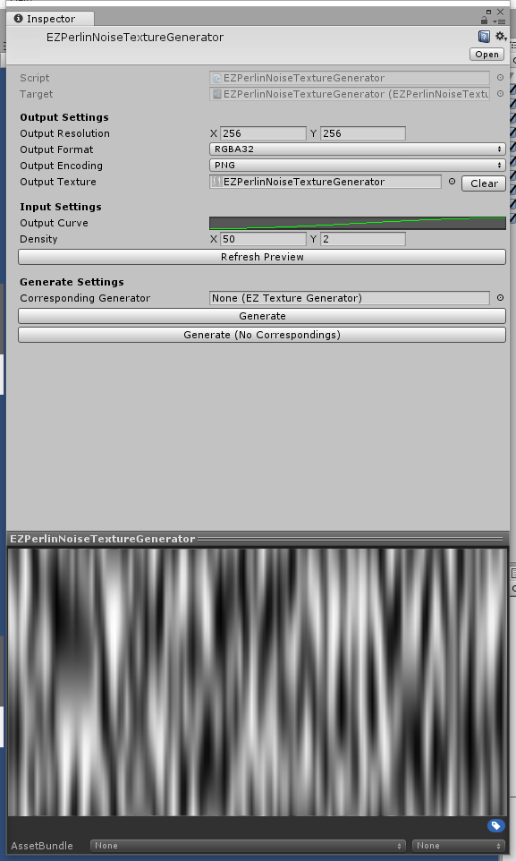

## EZPixelNoiseTextureGenerator

噪点图片生成

- Random Seed: 随机数种子
- Colored: 带色噪点
- Output Curve: 输出曲线（可用来控制噪点密度）

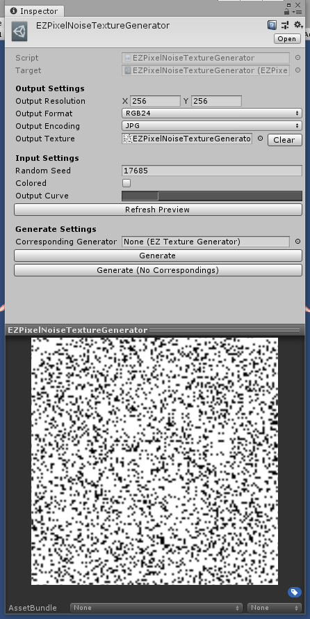

## EZSimpleNoiseTextureGenerator

随机噪声图片生成

- Noise Density: 噪声密度

## EZVoronoiTextureGenerator

泰森多边形图片生成

- Fill Type: 填充方式
  - Gradient: 中心到界限的渐变
  - Random: 随机色块填充
- Angle Offset: 随机向量的生成种子
- Voronoi Density: 噪声密度

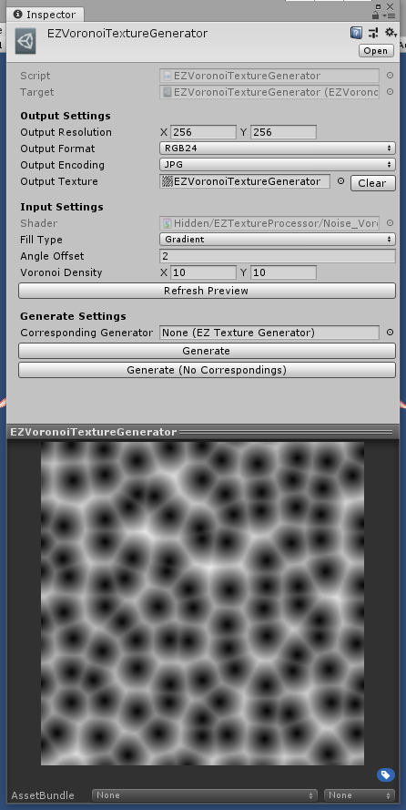

## EZWaveTextureGenerator

利用曲线来生成波浪形状

- Wave Shape: 波浪形状曲线
- Antialiasing: 抗锯齿

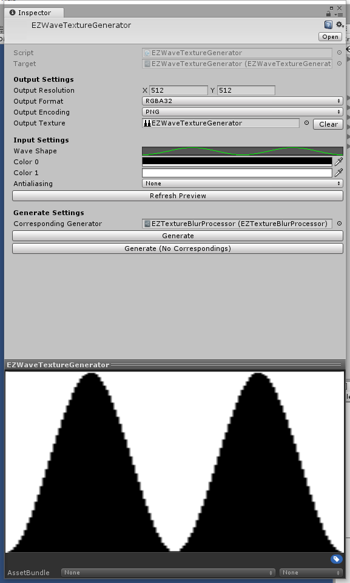

## EZTextureBlurProcessor

模糊处理工具

- Input Texture: 需要模糊的图片
- Blur Weight Texture: 模糊使用的权重查找表
- Blur Radius: 模糊范围

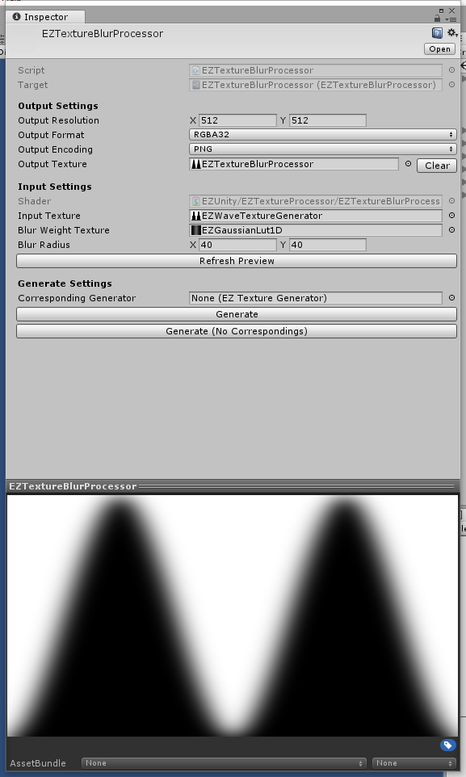

## EZColorBasedOutline

基于色彩容差的描边

- Input Texture: 需要描边的图片
- Gray Weight: 描边前会对图片转灰度图，权重控制灰度比例
- Tolerance: 容差
- Outline Color: 描边颜色
- Outline Thickness: 边缘检查的范围（描边粗细）

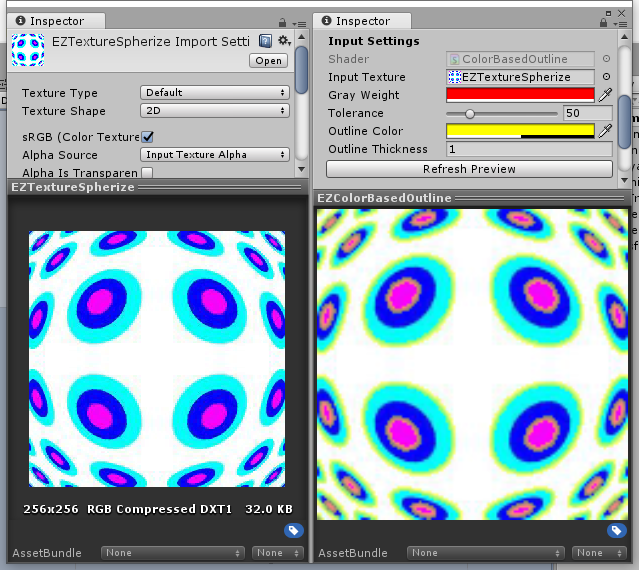

## EZTextureSpherize

球面化处理工具

- Input Texture: 输入图片
- Spherize Power: 球面化强度
- Spherize Center: 球面化中心
- Spherize Strength: 球面化范围

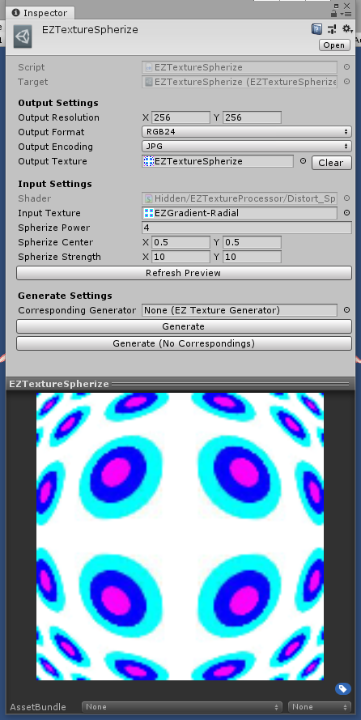

## EZTextureTwirl

漩涡扭曲处理工具

- Input Texture: 输入图片
- Twirl Center: 扭曲中心
- Twirl Strength: 扭曲强度

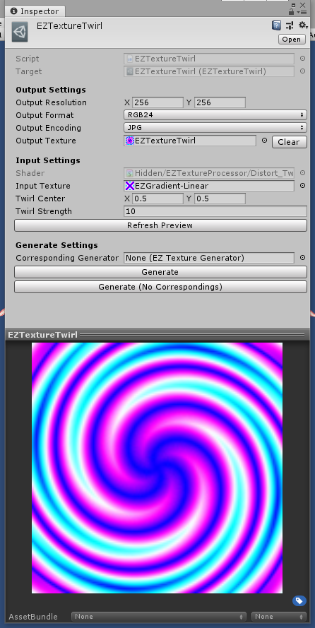

## EZTextureChannelModifier

图片通道调整（交换通道、提取单通道、调整特定通道曲线）

- Input Texture: 基础图片，默认输出白色
- Output Curve: 基础图片的调整曲线
- Overrides: 各通道单独指定输入输出
  - Texture: 该通道的输入图片
  - Channel: 输入图片的输入通道
  - Curve: 输入通道的输出曲线

*批处理模式下(Batch Mode Window)，会根据参数设置直接对当前选中的图片进行处理（使用前请自行备份相关资源）*

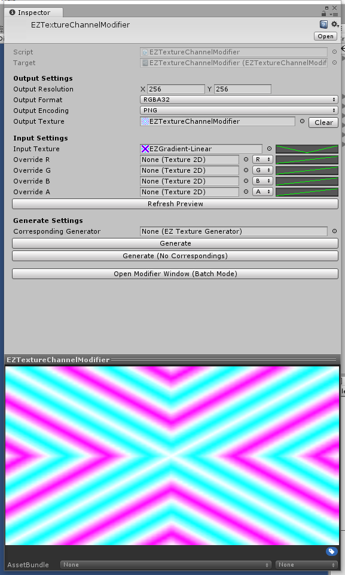

## EZTextureCombiner

整合图片，小图的尺寸需要相同

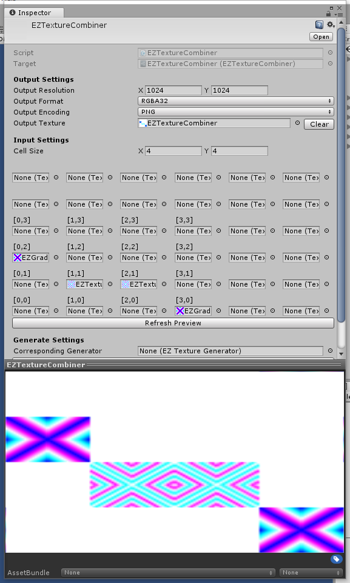

## EZMaterialToTexture

材质直接输出图片（不要使用依赖光照的Shader！！！）

## EZTexturePipeline

图片处理管线，多个图片处理会按顺序执行（与CorrespondingGenerator不同，管线不会生成中间图片）
