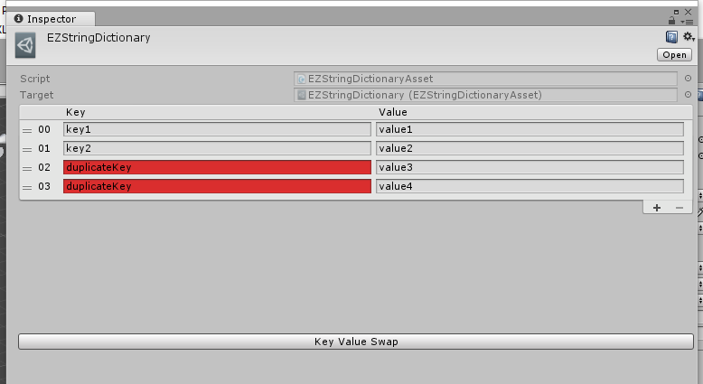

# Custom Assets

## EZStringCollection

(右键菜单/Create/EZUnity/EZStringCollection)

用来存放多语言的长文本。key如果重复会显示在红色背景中。

## EZStringDictionary

(右键菜单/Create/EZUnity/EZStringDictionary)

用来存放一个string的dictionary，设计初衷是做骨骼和变形器的名称适配。key如果重复会显示在红色背景中。

## EZImageCapture

## EZScriptStatistics

**用于统计当前的代码量**。

需要事先说明的是，代码量并不能作为一个程序猿的考核标准，只应作为项目和个人的工作情况分析，不应在人与人、项目与项目间进行比较。

需要统计的范围在File Association中配置，"File Patterns", "Include Paths", "Exclude Paths"分别为要分析统计的文件后缀，要统计的目录，和需要排除在外的目录。

统计信息的收集方式在下方的Analysis中配置，"Info Line Count"为脚本头部信息的行数，"Author Regex"为匹配作者信息的正则式（需要一个匹配结果），"Create Time Regex"为匹配脚本创建时间的正则式（需要一个匹配结果），"Valid Line Regex"为匹配有效行的正则式（并不需要匹配结果）。

点击"Refresh"按钮进行统计，文件会自动备份。

统计结果以Author进行分组，对每个Author显示其名称，贡献度，脚本数量，有效行数，总行数。对每个脚本显示其路径，创建时间，有效行数，总行数。

## EZPlayerBuilder

(右键菜单/Create/EZUnity/EZPlayerBuilder)

Unity工程的PlayerSettings和EditorBuildSettings设置是唯一的，但有些情况下我们工程中会有多个场景需要分别打包，Unity提供了Build Player Pipeline，可用代码控制打包流程。

## EZBundleBuilder

(右键菜单/Create/EZUnity/EZBundleBuilder)

Unity5.x中Bundle的build可以说是非常简单了，但是却没有一个官方的管理工具。
大部分项目使用bundle都是通过单个资源设置，然后代码中一句`BuildAssetBundles(string outputPath, BuildAssetBundleOptions assetBundleOptions, BuildTarget targetPlatform)`然后做成一个MenuItem，对于buildTarget、outputPath、后缀名等都是写死在代码中，通用性很差。

EZBundleBuilder会用一个*.asset文件保存Build偏好如：buildTarget, outputPath, fileExtension。选定该asset就可以编辑这些偏好，并且在Inspector界面中可以直接通过点击“Build Bundle”按钮进行build，并且还有SaveAs按钮可以将这个asset文件备份后进行修改，在测试时相当方便。(下面有图)

很多时候在build之后我们会需要将build的文件做一个list（方便热更新的文件检查，当然如果你不需要可以忽略），这个可以在Inspector界面中指定文件名，build完成后会自动生成一个包含文件名称，md5值，还有文件大小的文件清单。

有些时候需要在build前清除老的文件，ForceRebuild选项就是这个意思。

### Manager Mode 和 EZBundle Mode

大多数人熟知的bundle设置方式是对单个资源指定AssetBundleName，然后Build Bundle。通俗点说就是：**我要把这个asset，加入到这个Bundle里面**。

而我个人在项目中对目录结构进行了规划，目录结构就决定了bundle的结构，期望的bundle管理方式是：**我要Build一个Bundle，它包含某个目录下的所有满足条件的asset**。好在Unity提供了另一个重载方法`BuildAssetBundles(string outputPath, AssetBundleBuild[] builds, BuildAssetBundleOptions assetBundleOptions, BuildTarget targetPlatform)`，这个方法不用在编辑器的Inspector界面中去挨个指定单个asset的AssetBundleName，而是可以自己通过代码去“收集”和“分类”想要build的asset。

**EZBundleBuilder可以在两种Build方式间随意切换**。

在选项中有一个Manager Mode，默认情况下是没有勾选的，这时你需要在一个列表中设置BundleName，然后指定这个Bundle以某个Pattern根据某种SearchOption在SourcePath中获取asset。这种方式对于已经有很多资源但是却一直没有bundle规划的项目来说相当友好，当然，如果你在这种情况下又没有一个好的资源目录结构，那我就无能为力了。不过，整理一下目录也不是个什么难事，比起下文介绍的方式，维护起来也要简单那么一点。

如果你勾选了Manager Mode，那么这个Bundle的设置界面会变成一个BundleManager界面，你可以看到目前你项目中所有AssetBundleNames，这个Name下面包含了哪些文件，以及它的Dependencies。这时界面中的“Build Bundle”按钮就会以这种方式进行build，EZBundle模式下的Bundle设置不会起任何作用（你也可以直接在UnityEditor的顶部菜单中点击"EZUnityEditor/EZBundle/EZBundleManager"打开单独的EZBundleManager窗口）。这个模式下虽然不能直接修改，但是你可以查看到所有设置过AssetBundle的asset，点击一下跳转到该资源，用起来也省掉大把可以用来快活的时光。

### Attributes

`OnPreBuildAttribute`, `OnPostBuildAttribute` 和CopyList

对于build Bundle，很多情况下意味着要出包，而出包，往往要做的前期工作不仅仅是build Bundle。

在使用EZBundleBuilder进行Build时，首先会通过反射寻找所有`OnPreBuild`标记过的方法并执行，然后执行CopyList中指定的拷贝，然后才是build bundle，最后会以`BuildPipeline.BuildAssetBundles`返回的`AssetBundleManifest`作为参数，调用`OnPostBuild`标记过的方法。

例如：该工程下的EZUnity使用了xlua，为了方便开发，所有的lua文件都以.lua为后缀，但是.lua文件是不会被build到bundle中的，所以在bundle前需要将这些文件拷贝并添加.txt后缀，为了方便读取还将路径中的slash改成了双下划线（PS: CopyList只能复制，做不到改名啥的），这个改名的工作也用方法进行了封装并做了一个菜单项，但每次在build前都需要点一下这个，也实在是有点浪费我右手的ATP和APM，于是我将该方法标记了`OnPreBuild`，这时候build前就会自动拷贝覆盖掉老的.lua.txt文件，节省了时间，还避免了遗忘导致build进去的是老代码的情况。  
而某个SDK，在安卓平台打包前需要将一些文件拷贝覆盖到StreamingAssets目录下，这时候只需要将原路径和目的路径添加在CopyList中，每次点击build bundle时这个事情就自动完成了。  
PS: `OnPostBuild`由于目前项目中没有具体需求，所以测试覆盖面不够太。
