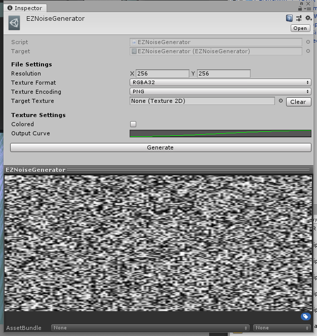
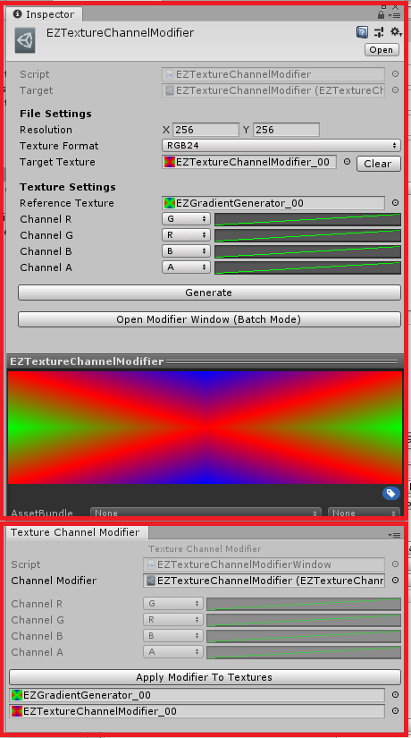
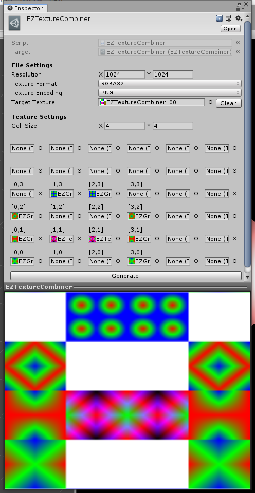

# EZAssetGenerator

根据一些简单的参数来生成资源的工具

## EZColorLerpTextureGenerator

根据曲线在U方向做两个颜色的插值

## EZGradientGenerator

渐变生成图片，配合XY轴的曲线可以生成很多复杂图案

## EZNoiseGenerator

噪点图片

## EZPerlinNoiseGenerator

柏林噪声图片

## EZWaveTextureGenerator

利用曲线来生成波形图

## EZTextureAntialiasing

抗锯齿（大图改小图才有效果）

[!EZTextureAntialiasing](.SamplePicture/EZTextureAntialiasing.png)

## EZTextureChannelModifier

图片通道调整（交换通道、提取单通道、调整特定通道曲线）

- 普通模式下会根据ReferenceTexture和参数设置来生成并覆盖TargetTexture（如果不指定TargetTexture则会生成新的图片资源）
- 批处理模式下(Batch Mode Window)，会根据参数设置直接对当前选中的图片进行处理（使用前请自行备份相关资源）

## EZTextureCombiner

图片合并

## EZPlaneGenerator

用来生成自定义细分精度的Plane(Quad)  
*预览界面用到的材质是"VR/SpatialMapping/Wireframe"，目前发现部分版本该材质不可用，不影响网格Mesh的生成*

