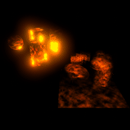
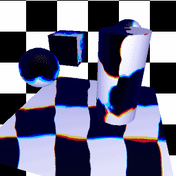
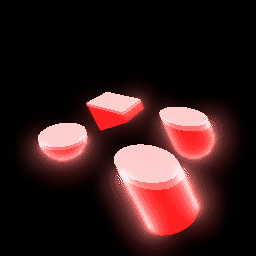
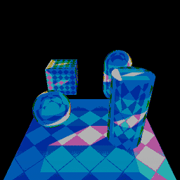
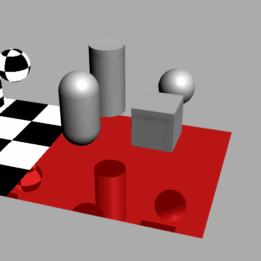
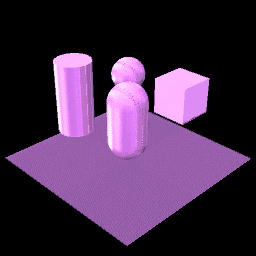
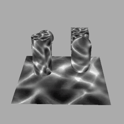

# Materials

## DynamicFlame

[Shader: Shaders/Unlit/DynamicFlame.shader](../../Shaders/Unlit/DynamicFlame.shader)

## DynamicFluid

[Shader: Shaders/Unlit/DynamicFluid.shader](../../Shaders/Unlit/DynamicFluid.shader)

## WobblingLiquid

[Shader: Shaders/Unlit/WobblingLiquid.shader](../../Shaders/Unlit/WobblingLiquid.shader)

[C#: EZWobblingLiquid](../../Runtime/Miscellaneous/EZWobblingLiquid.cs)

## LaserProcessed

[Shader: Shaders/Unlit/LaserProcessed.shader](../../Shaders/Unlit/LaserProcessed.shader)

## Fur

[Shader: Shaders/Fur.shader](../../Shaders/Fur.shader)

## Reflection

[Shader: Shaders/Effects/EZReflection.shader](../../Shaders/Effects/EZReflection.shader)

[C#: EZReflection](../../Runtime/Miscellaneous/EZReflection.cs)

## Matcap

[Shader: Shaders/Matcap.shader](../../Shaders/Matcap.shader)

## UVStreamer

[Shader: Shaders/Unlit/UVStreamer.shader](../../Shaders/Unlit/UVStreamer.shader)

## MultiTexture3x

[Shader: Shaders/Unlit/MultiTexture3x.shader](../../Shaders/Unlit/MultiTexture3x.shader)